# Used Car Price Prediction & Fair Pricing System

This project focuses on predicting used car prices based on vehicle characteristics and providing
**transparent and actionable pricing recommendations** for sellers.

Instead of producing a single point estimate, the system predicts a **fair price range** using
**quantile regression** and explains predictions using **SHAP**.

---

## Motivation

Pricing a used car is inherently uncertain:

- Overpricing discourages buyers
- Underpricing may reduce trust or cause financial loss
- Market prices vary due to negotiation, demand, and seller urgency

This project addresses these challenges by combining:
- Robust machine learning models
- Explainable AI techniques
- Price uncertainty modeling

---

## Exploratory Data Analysis (EDA)

### Price Distribution
Used car prices are heavily right-skewed, with most vehicles concentrated in lower price ranges.

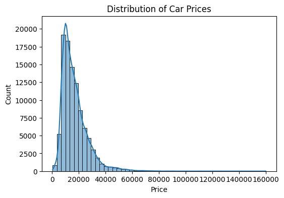

---

### Log-Transformed Price Distribution
Prices were log-transformed to reduce skewness and stabilize variance.

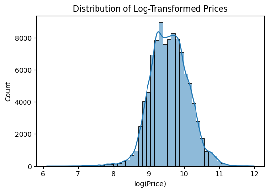

---

### Vehicle Age vs Price
Vehicle prices decrease as age increases, showing a strong nonlinear relationship.

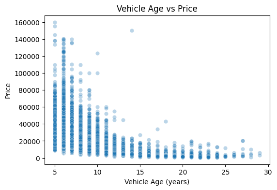

---

### Mileage vs Price
Higher mileage is clearly associated with lower prices.

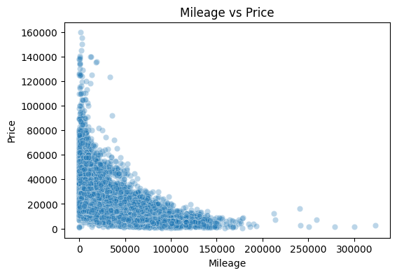

---

### Price Distribution by Fuel Type
Fuel type influences pricing, with electric and hybrid vehicles generally priced higher.

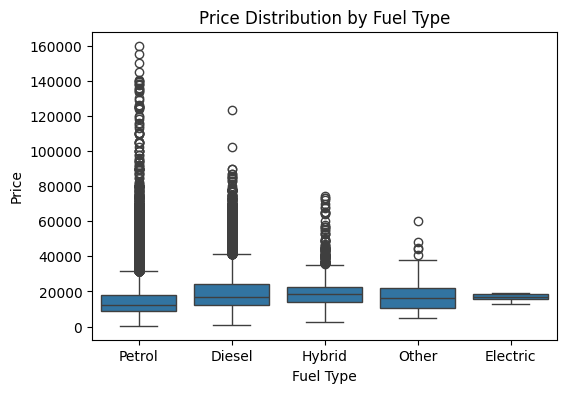

---

### Price Distribution by Transmission Type
Automatic vehicles tend to have higher prices than manual ones.

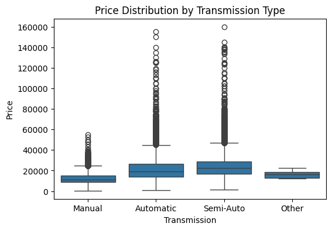

---

### Engine Size vs Price
Larger engine sizes are associated with higher prices, with increasing variance.

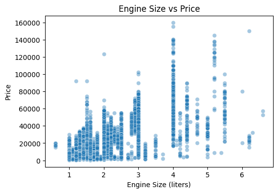

---

## Model Training

### Model Choice
- **CatBoostRegressor**
- Native support for categorical variables
- Strong performance on tabular data
- Robust to nonlinear interactions

The target variable was modeled as **log(price)**.

---

### Model Performance
- **Test MAE:** approximately **£1,142**

This error level is acceptable in the used car market, where negotiation and seller behavior
introduce natural variability.

---

## Model Explainability with SHAP

### Global Feature Importance
SHAP summary plots show the most influential features.

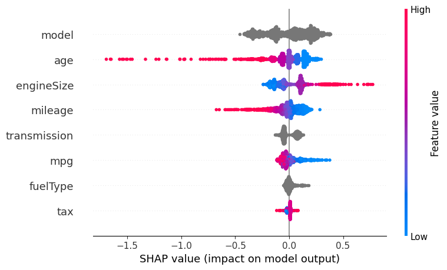

Key drivers:
- Vehicle model
- Vehicle age
- Engine size
- Mileage

---

### Local Explanation (Single Vehicle)
Waterfall plots explain individual predictions.

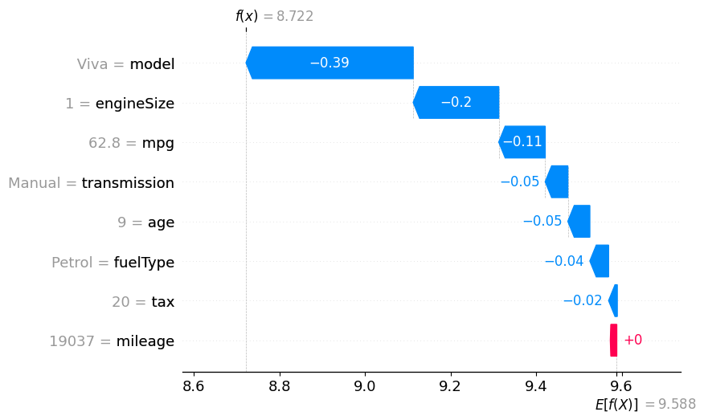

---

### Feature Behavior Analysis
SHAP dependence plots confirm interpretable feature–price relationships.

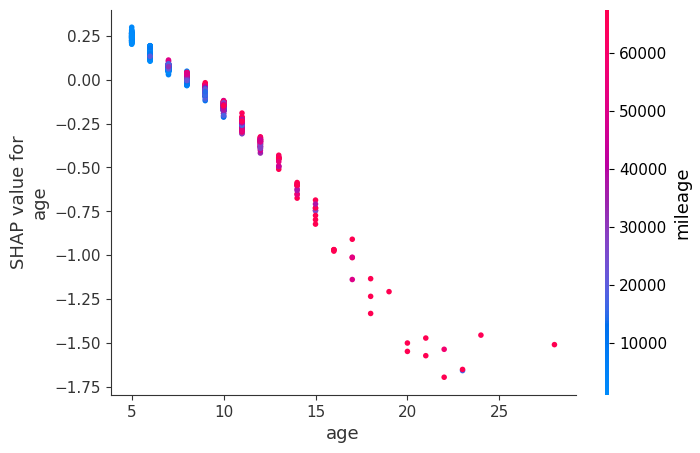

---

## Fair Price Range Estimation (Quantile Regression)

### Why Price Ranges Matter
Single-point predictions imply false certainty. Real markets require **price intervals**.

---

### Quantile Regression with CatBoost
Three separate models were trained:

- **25th percentile:** lower bound
- **50th percentile:** recommended price
- **75th percentile:** upper bound

Example output:

Lower bound (25%):        £5,939  
Recommended price (50%): £6,135  
Upper bound (75%):       £6,560  

---

## FastAPI – Price Range Prediction API

The trained models are exposed via a **FastAPI** service that returns a fair price range.

---

### API Access

- **Swagger UI:** http://127.0.0.1:8000/docs
- **Health Check:** http://127.0.0.1:8000/health

---
---

## Streamlit – Interactive Frontend

An interactive Streamlit application is built on top of the FastAPI backend to allow
users to input vehicle details and instantly receive a fair price range.

The interface communicates directly with the FastAPI `/predict` endpoint and displays
quantile-based pricing results (Q25 / Q50 / Q75) in a clear and user-friendly layout.

---

### Streamlit Interface – Main View

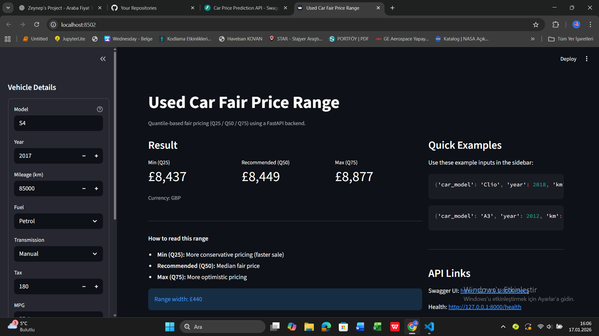

---

### Streamlit Interface – Result & API Integration

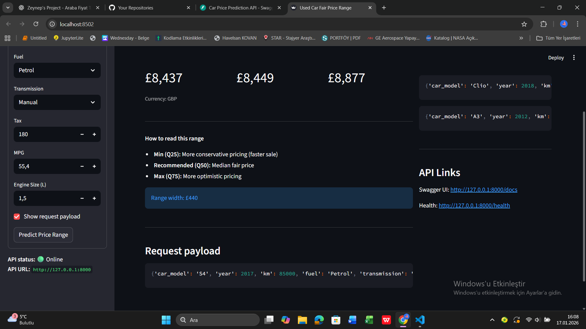

---

---

Key Takeaways

Realistic used car pricing behavior is captured

Predictions are explainable at both global and individual levels

Quantile-based price ranges provide actionable guidance

The system is suitable for real-world deployment

Next Steps

Streamlit-based interactive interface

Dockerization

Cloud deployment

Technologies Used

Python
Pandas, NumPy
CatBoost
SHAP
FastAPI
Streamlit
Matplotlib / Seaborn

---